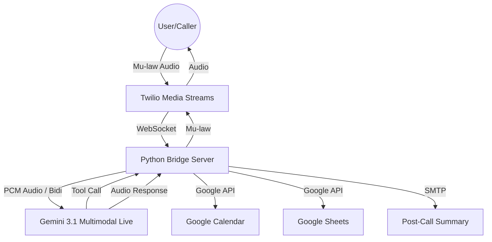

# 🚀 Priya: The Native Speech-to-Speech AI Receptionist 🏥☎️

A cutting-edge, low-latency AI voice receptionist built using **Google Gemini 3.1 Multimodal Live**. Designed for high-traffic clinics and SMEs, this agent provides human-speed interaction, native Hinglish support, and deep enterprise integration.

---

## 🌟 Why this project? (The "Why")

In healthcare, "Front-Desk Fatigue" isn't just an HR issue—it’s a patient experience crisis. 📉
Small-to-medium medical clinics face massive operational bottlenecks: missed calls, scheduling errors, and data entry delays.

**Priya** was built to solve this by:
*   **Zero Latency**: Eliminating the "robotic delay" of traditional voice bots.
*   **Native Hinglish**: Localizing the experience to build trust with parents.
*   **End-to-End Automation**: Connecting the phone line directly to the clinic's core workflow.

---

## 🎙️ What is built? (The "What")

This is a **Native Speech-to-Speech (S2S)** intelligence layer. Unlike traditional bots that follow a slow `Audio -> Text -> LLM -> Text -> Audio` loop, Priya "hears" and "speaks" audio directly using the Gemini 3.1 Multimodal Live protocol.

### ✨ Core Features:
-   **📅 Live Booking**: Instant slot checking and booking via **Google Calendar**.
-   **📊 Automated Logging**: Real-time interaction logging into **Google Sheets**.
-   **📧 Clinical Briefing**: Automated post-call summary emails sent to doctors via **Gmail**.
-   **🗣️ Humanized Pacing**: Programmed to pause, listen, and use natural conversational fillers (Hinglish).

---

## 🏗️ How it works? (The "How")

The system operates as a high-performance **WebSocket Bridge** between Twilio (Telephony) and Google Gemini (AI).

### 📐 Architecture Diagram



### 🔹 Technical Highlights
-   **Dual-Protocol Bridge**: Translates 8kHz telephony audio to 24kHz AI-native PCM in real-time.
-   **Asynchronous Processing**: Built with `asyncio` to handle multiple audio buffers concurrently.
-   **Dynamic Context**: Priya is injected with the real-time date and time at the start of every call to ensure accurate scheduling.

---

## 🛠️ Tech Stack
-   **AI Engine**: Google Gemini 3.1 Flash Live (Multimodal)
-   **Telephony**: Twilio Voice (Media Streams)
-   **Integrations**: Google Calendar API, Google Sheets API, Gmail API
-   **Language**: Python 3.12+ (AsyncIO, WebSockets)

---

## 🚀 Setup & Execution

### 1. Configuration
Create a `.env` file:
```env
GEMINI_API_KEY=your_key
GMAIL_USER=your_email@gmail.com
GMAIL_APP_PASSWORD=your_app_password
DOCTOR_EMAIL=recipient@example.com
GOOGLE_CALENDAR_ID=primary
```
Ensure `google-credentials.json` (Service Account) is in the root directory and has **Editor** access to your Spreadsheet and Calendar.

### 2. Run
```powershell
pip install -r requirements.txt
python gemini_main.py
```

---

## 📈 Future Roadmap: Enterprise Grade
- [ ] **Multi-Cloud Fallback**: Switching between Google & Azure AI for 99.9% uptime.
- [ ] **Deep Observability**: Real-time tracking of:
    - Voice Quality & Tone (Latency/Sentiment).
    - Unit Economics (Cost-per-call, Token consumption).
    - Session Success (Completion rates vs. duration).

---

**Built with ❤️ for Healthcare Innovation.**
```
,Description:
